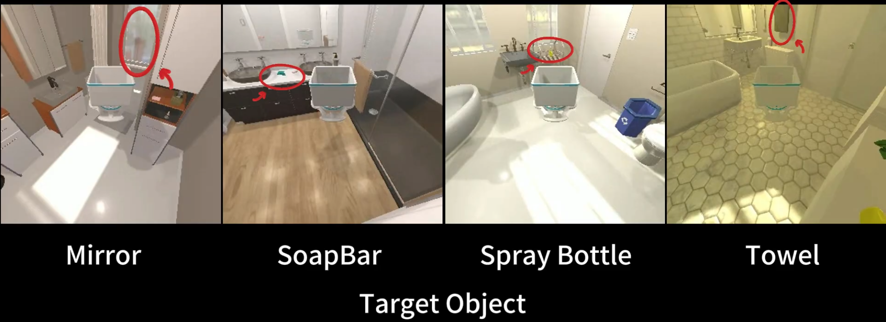
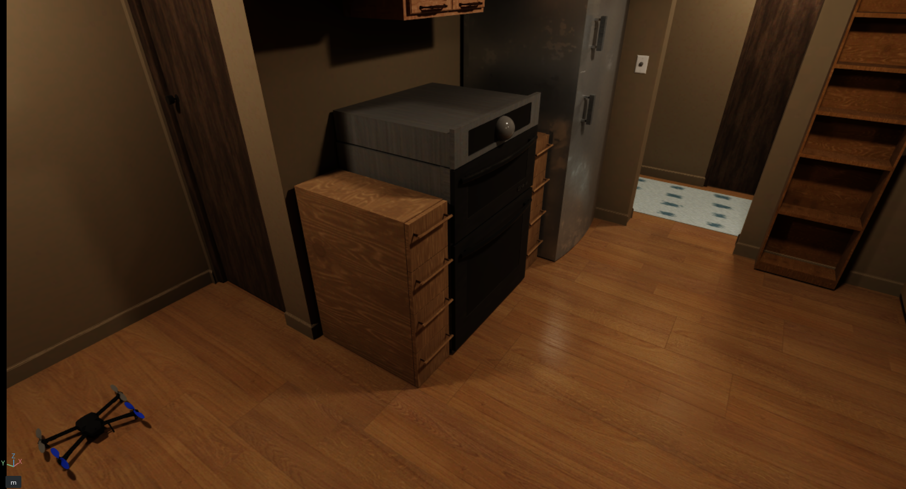

[](https://arxiv.org/pdf/2601.15614)
[](https://youtu.be/TgsUm6bb7zg)
[](https://github.com/Zichen-Yan/AION)

# 1. AI2THOR Training and Evaluation

## Prerequisite
```
conda create -n aion python=3.10
conda activate aion

cd ~
git clone https://github.com/Zichen-Yan/AION.git
cd ~/AION
pip install -r requirements.txt
pip install git+https://github.com/openai/CLIP.git
```
## Data
The data file can be found [here](https://drive.google.com/file/d/1TdiPQuChbyrh9JzIoBvRGpuknzoWLXFg/view?usp=drive_link).

The ckpt can be found [here](https://drive.google.com/file/d/1a_Dk09y2GhtZvlXo3c4TjSxf_WI-SdwS/view?usp=drive_link). 

data/ and ckpt/ should be put in the root dir.

## Train Goal-Reaching 
### AIONg 
#### split = [14/8, 18/4]
```bash
python main.py \
    --title AIONg\
    --model AIONg\
    --gpu_ids 0\
    --workers 25\
    --vis False\
    --save_model_dir trained_models\
    --max_episode_length 50\
    --snapToGrid False\
    --rollout_steps 128\
    --max_steps 1e7\
    --split 18/4\
    --add_clip_align True\
    --add_stats True\
    --add_depth True\
    --add_rgb True\
    --add_dis_reward True\
    --add_bbox_reward True\
    --add_parent_reward True\
    --add_collision_reward True
```
 
### Baselines
#### model = [ZSON, BaseModel, GCN, MJO]
```bash
python main.py \
    --title ZSON \
    --model ZSON \
    --gpu_ids 0 \
    --workers 30 \
    --vis False \
    --save_model_dir trained_models \
    --max_episode_length 50 \
    --snapToGrid False \
    --rollout_steps 128 \
    --max_steps 1e7 \
    --split 18/4 \
    --add_stats True
```

## Evaluate Goal-Reaching
### AIONg
#### get_seen_data = [False, True]
```bash
python main.py \
    --eval \
    --test_or_val test \
    --episode_type NavTestEpisode \
    --load_model ckpt/AION-g-18-4.dat \
    --model AIONg \
    --results_json 3D.json \
    --gpu_ids 0 \
    --vis False \
    --get_seen_data False \
    --snapToGrid False \
    --split 18/4 \
    --save_visuals True \
    --save_episode_data True
```

#### Baselines
```bash
python main.py \
    --eval \
    --test_or_val test \
    --episode_type NavTestEpisode \
    --load_model ckpt/ZSON.dat \
    --model ZSON \
    --results_json 3D.json \
    --gpu_ids 0 \
    --vis False \
    --get_seen_data False \
    --snapToGrid False \
    --split 18/4 \
    --save_visuals True \
    --save_episode_data True
```

## Train Exploration
### AIONe
```bash
python main.py \
    --title AIONe \
    --model AIONe \
    --episode_type ExplorationTrainEpisode \
    --gpu_ids 0 \
    --workers 40 \
    --vis False \
    --save_model_dir trained_models \
    --max_episode_length 50 \
    --snapToGrid False \
    --rollout_steps 128 \
    --scene procthor \
    --offline_data_dir ./data/procthor_offline_data/train \
    --action_space 5 \
    --max_steps 4e6
```

# 2. IsaacSim Evaluation Env (22.04 + Python 3.10 + ROS2 humble + ISAACSIM 5.1.0 + Pegasus)

## Download [ISAAC-SIM](https://docs.isaacsim.omniverse.nvidia.com/5.1.0/installation/quick-install.html) to 
### ~/.local/share/ov/pkg/isaac-sim-5.1.0
## Modify .bashrc
```bash
export ISAACSIM_PATH="${HOME}/.local/share/ov/pkg/isaac-sim-5.1.0/"
export ISAACSIM_PYTHON_EXE="${ISAACSIM_PATH}/python.sh"
alias ISAACSIM_PYTHON="$ISAACSIM_PATH/python.sh"
alias ISAACSIM="$ISAACSIM_PATH/isaac-sim.sh"
```
## ROS2 PX4 Prerequisite
#### Change the ROS2 version in DroneSim/scripts/install_ros2.sh (ROS2_VERSION)
```bash
cd ~
git clone https://github.com/isaac-sim/IsaacSim-ros_workspaces.git

cd ~/AION/DroneSim/
bash install.sh
```
## Install Micro-XRCE-DDS
```bash
cd ~
git clone https://github.com/eProsima/Micro-XRCE-DDS-Agent.git
cd Micro-XRCE-DDS-Agent
mkdir build
cd build
cmake ..
make
sudo make install
sudo ldconfig /usr/local/lib/
```
## Install Pegasus Simulator
```bash
cd ~
git clone https://github.com/PegasusSimulator/PegasusSimulator.git
cd ~/PegasusSimulator/extensions
ISAACSIM_PYTHON -m pip install -e pegasus.simulator/
```
## Modify the PX4 path in
### PegasusSimulator/extensions/pegasus.simulator/config/configs.yaml
```bash
px4_dir: ~/PX4-Autopilot
```
## Compile px4msgs
```bash
sudo apt install python3-empy python3-colcon-common-extensions

mkdir -p ~/px4msg_ws/src
cd ~/px4msg_ws/src
git clone -b release/1.16 https://github.com/PX4/px4_msgs.git
cd ~/px4msg_ws
colcon build
echo "source ~/px4msg_ws/install/setup.bash" >> ~/.bashrc
```
# 3. Evaluation in ISAAC-SIM
## 3.1 Terminal 1 Start Simulator
```bash
# start pegasus simulator in IsaacSim with PX4 SITL
conda deactivate
source ~/IsaacSim-ros_workspaces/build_ws/humble/humble_ws/install/setup.bash

cd ~/AION
export MDL_USER_PATH=DroneSim/Scenes/MTL
ISAACSIM_PYTHON DroneSim/isaac_env.py
```
## 3.2 Terminal 2 Run DDS
```bash
MicroXRCEAgent udp4 -p 8888
```
## 3.3 Terminal 3 Run Algorithm
```bash
conda activate aion
cd ~/AION
python main_isaacsim.py
```
# 4. Citation
```
@article{yan2026aion,
  title={AION: Aerial Indoor Object-Goal Navigation Using Dual-Policy Reinforcement Learning},
  author={Yan, Zichen and Hou, Yuchen and Wang, Shenao and Gao, Yichao and Huang, Rui and Zhao, Lin},
  journal={arXiv preprint arXiv:2601.15614},
  year={2026}
}
```